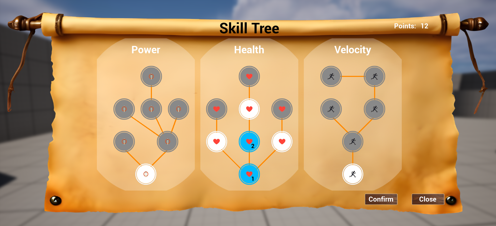
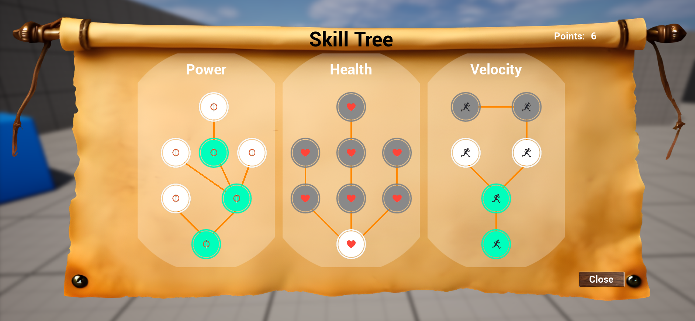

# Skill Tree UI System Documentation

The final exercise for the User Interface class is composed of three main widget classes:

- `USkillTreeWidget`
- `USkillBranchWidget`
- `USkillNodeWidget`

## Overview

The Skill Tree UI is a user interface that allows players to view, select, and acquire skills in a hierarchical structure. It supports different interaction modes such as selection and held-based confirmation and provides visual and sound feedbacks.
When the Skill Tree widget is visible, the game is paused.
The mode can be changed in the Skill Tree widget instance (Content/FirstPerson/Blueprints/UI/SkillTree/WBP_SkillTree.uasset) in the category Skill Tree (Held mode) and also the time to held the button (Held time).
The available skill points to redeem are assigned in a public variable in the character (Content/FirstPerson/Blueprints/BP_FirstPersonCharacter.uasset) in UI/Skill Tree category (Available Points). By default, the character has 15 points to redeem.
Buttons used in the exercise:
- Key P -> to show / hide the Skill Tree widget.
- Left mouse button -> to select / acquire the skills.

---

## `USkillTreeWidget`

### Description

Represents the main UI for the skill tree. 
It is responsible for the next tasks:

- Show and hide the skill tree.
- Manage available skill points.
- Manage the confirm / held mode.
- Play UI sounds.
- Confirm acquisition of selected skills.
- Display feedback to the player.

It collects all the Branch widgets in the Skill Tree widget in NativeConstruct to setup and add them to m_lSkillBranch list.
The feedback text uses a FTSTicker because the game is in pase mode. It will hide the text after 3 seconds.

## Audio Feedback

Sound effects are played based on interaction type using the `ESoundType` enum:

- `OpenClose`
- `Confirm`
- `Focus`
- `Select`
- `Deselect`
- `Error`

---

## `USkillBranchWidget`

### Description

A container widget for a group of related skills (nodes). Each branch is independently configured and can contain hierarchical dependencies between skills.

- It setups skill nodes and parent/child relations.
- It deselects selected nodes.
- It acquires selected skills.

It collects all the Node widgets in the Skill Branch widget in SetupBranch function to setup and add them to m_mSkillNode map.

---

## `USkillNodeWidget`

### Description

Represents an individual skill node. Nodes can be in a locked, unlocked, or selected state. Some skills may require other skills as prerequisites.

- It manages state transitions (locked, unlocked, selected, acquired).
- It handles user interactions (hover, click, hold).
- It coordinates with parent and child nodes.
- It communicates with the skill tree to update points and feedback.

In SetupNode function, the parent tree and the callback to unlock the node when the parent is selected or acquired are configured. The nodes has parameters for it's own ID and the parent node ID to build the tree structure. It could be configure in the skill node instance.
The nodes will be unlocked when its parent node is selected or acquired. If the parent node is deselected, the children will be locked again returning the points to available points.
When held mode is active, there is a circular progress bar in the skill node. It will be visible when the user tries to acquire the skill as visual feedback.
The Node has also a type image. A texture can be added in the skill node instance.
The cost to acquire the node can be modified in the skill node instance. It will show in the tree when the user hover or select the node.
The reference to the skill tree parent is necessary to get the available points, play sounds and show the text feedbacks.